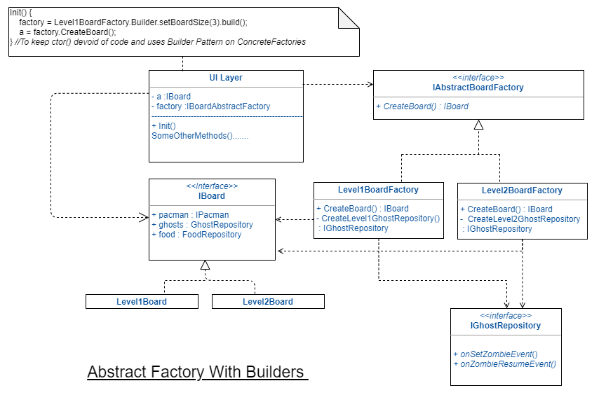
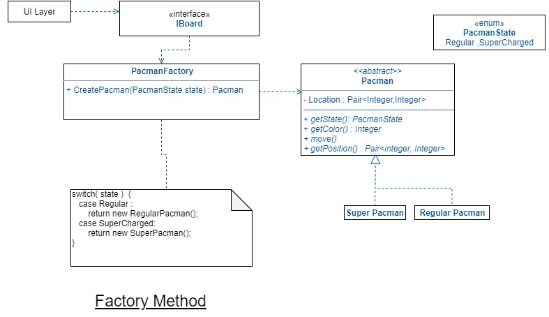

# Design Patterns
> NOTE : Open the pacman digram using this ![link] (https://app.diagrams.net/#Uhttps%3A%2F%2Fraw.githubusercontent.com%2Fanandr781%2FDesignMusings%2Fmain%2FOOAD%2FDesignPatterns%2Fpacman.drawio)

## Creational 
* __[`Abstract Factory`](#AbstractFactory)__
*  __[`Builder`](#Builder)__
*  __[`Factory Method`](#FactoryMethod)__
*  __[`Singleton`](#Singleton)__
*  __[`Bridge`](#Bridge)__
*  [`Prototype`](#ProtoType)


## Structural
*  __[`Adapter`](#Adapter)__
*  __[`Proxy`](#Proxy)__
*  __[`Composite`](#Composite)__
*  __[`Facade`](#Facade)__
* [`FlyWeight`](#Flyweight)
* [`Decorator`](#Decorator)

## Behavioural
* __[`Command`](#Command)__
* __[`Iterator`](#Iterator)__
* __[`Mediator`](#Mediator)__
* __[`State`](#State)__
* __[`Strategy`](#Strategy)__
* __[`Template`](#Template)__
* __[`Observer`](#Observer)__


### AbstractFactory 
---

Object creation while retaining control of which classes to instantiate are cases where _FACTORY METHOD_ pattern with a method that uses an out-side factor to determine which classes to instantiate. There are occasions when the factor that controls the instantiation of can be thematic and can run across several classes, that is when _**Abstract Factory**_ is really useful.

> Abstract Factory frees a client from knowing which classes to instantiate when it needs new objects (aka thematic). In this regard, _ABSTRACT FACTORY_ is similar to _FACTORY METHOD. In some cases, what starts as a Factory Method pattern eventually grows into an Abstract Factory pattern._

__Use the Abstract Factory when....__
* A system should be independent of how its products are created, composed and represented (aka __thematic__). 
* A systemc can be configured with one of the multiple families of objects/products.
* The contraint requiring products from the same factory to be used together must be enforced. 



### Builder
---

A Builder class offloads construction logic from a domain class and can accept initialiation parameters . Builder pattern also helps in constructing object with a optional attributes and with certain validations or constraints surrounding on how they are set . So certain parts of the object can adjusted along with the object creation. So in short, __serves both object construction and setting some of the optional class attributes correctly to ensure validity__. 

At an abstract level, both Builder and Abstract Factory look very similar. However _builder is more concerned about creating a single object and abstract factory in creating families of related objects_.

_The Builder pattern can also be used with Composite Pattern to construct the composite object recursively and Bridge pattern along with Abstract Factory._

Some Builder examples are : StringBuilder and GsonBuilder.

__Use the Builder when....__
* The algorithm of creating parts is independent of the parts themselves.
* The object to be assembled can have different representations.
* You need control over construction process. 


### FactoryMethod
---
The Factory Method pattern lets a class developer to define the interface for creating an object while retaining control of which class to instantiate.
Hence _relieving the client of knowing which sub-class to instantiate_.

> **Does Static Factory Method Pattern violate OCP**
>
>What is a static class? Actually, it has nothing to do with OOP. We are not going to create an instance of the static factory. We have a set of statements (constructors) that are being executed one by one. It is a procedural code, not an object-oriented one. Static factory represents a procedure written with class syntax. _So, maybe we shouldn’t treat static factory as an OOP code and try to apply SOLID principles to it. In other words, something that is static does not comply with polymorphism._

__Use Factory Method when....__
* Flexbility is important
* Objects can be extended in subclasses
* There is a specific reason whe one subclass would be chosen over another - _this logic forms a part of the Factory Method_.
* A client delegates responsibilities to subclasses in parallel hierarchies. 



### Singleton
---
The purpose of the Singleton pattern is to ensure that there is only one instance of a class, and that there is a global access to that object. _Due to addition to the global state, it is important to create the singleton only when its needed._

__Lazy Initialized and thread-safe initialization__ are important considerations . The target class must be marked with a private constructor as a deterrent.

__Abstract Factories, Builders and Prototypes__ can all be implemented as __Singletons__.

References : https://csharpindepth.com/articles/singleton and https://dzone.com/articles/singleton-bill-pugh-solution-or-enum

```java
//Bill Pugh Singleton implementation is shown below for lazy and thread-safe init.
public class Logger {
    private Logger() {
        // private constructor
    }

    // static inner class - inner classes are not loaded until they are
    // referenced.
    private static class LoggerHolder {
        private static Logger logger = new Logger();
    }
    // global access point
    public static Logger getInstance() {
        return LoggerHolder.logger;
    }

    //Other methods
}
```

```c#
public sealed class Singleton
 {
    private Singleton() {
       // private constructor
    }
    //global access point
    public static Singleton Instance { get { return Nested.instance; } }

    private class Nested
    {
        // Explicit static constructor to tell C# compiler
        // not to mark type as beforefieldinit
        static Nested()
        {
        }

        internal static readonly Singleton instance = new Singleton();
    }
 }
```

### Bridge 
---
Decouples an abstraction from its implementation, enabling them to vary independently. _You can create an  **interface** to achieve this goal._

> In its simplest form an abstract class is a class that depends on abstract methods. The simplest form is an abstract hierarchy where the concrete methods of that abstact class depend on other abstract methods. This is best use case for the Bridge pattern.

__Use Bridge Method when....__
* You can identify that there are operations that do not always need to be implemented the same way.
* You want to completely hide the implementation from clients of the concrete parts of the abstraction. 
* You want to __Avoid binding the implementation / concrete class to an abstraction.__
* You want to combine different parts of a system at runtime. 


### Prototype
---
https://www.dineshonjava.com/prototype-design-pattern/

__Key points on ProtoType ....__
* When you have few variations in the initialization parameters or set certain initial state of the object at instantiation time. ProtoType is very useful and can be paired with _Composite, Abstract Factory_ patterns. 
* Decide on __shallow or deep copy__ of the object : This can be usually done depending on whether immutable attributes (shallow copy) or mutable attributes (deep copy) are present in the object. 
* Abstract factory , ProtoType and in general creational patterns are very similar between each other.

### Adapter 
---
Class Adapter and Object Adapter --> A very simplest ones and well understood so we'll have details later till then you go to https://refactoring.guru/design-patterns/adapter

### Composite
---
